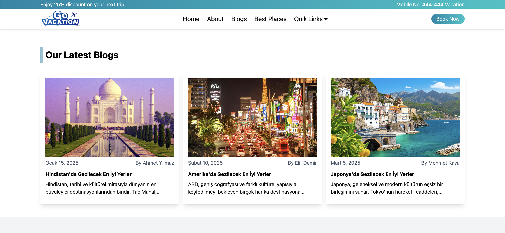

# Booking App

## ✨ Overview

Booking App is a modern and user-friendly holiday booking application developed using React and Vite. Users can explore popular destinations, read blog posts written by authors, and organize their travel plans.

## Screenshots 🖼️

### Video GIF


### homeScreen


### places


### bannerPic


### latestBlogs



### banner


### testimonial


### footer


### aboutUs


## Technologies

Key technologies and libraries used in this project:

- React & Vite - For a fast and efficient development experience

- Tailwind CSS - For modern and responsive design

- React Router DOM - For seamless page navigation

- React Icons - To enhance visual appeal

- React Slick Carousel - For slider and carousel components

- AOS (Animate on Scroll) - For scroll animations

### Features

- User-friendly and modern interface

- View destinations

- Read travel-related blog posts

- Smooth navigation between pages with React Router

- Responsive design

- Animated and interactive components

### Installation

To clone and run the project on your local machine:

- Clone the repository

```
git clone https://github.com/ozerbaykal/bookingAppReactJs.git
```

- Navigate to the project folder

```
cd bookingAppReactJs
```

- Install dependencies

```
npm install
```

### Run the application

```
npm run dev
```

### 🔧 Usage

- View popular destinations on the homepage.

- Read travel articles on the blog page.

- Enjoy an intuitive experience with a user-friendly interface and animations.

## Developer

Özer Baykal

## ✨ Contributions

Contributions are welcome! Please open an issue first to discuss what you would like to change.

- 1.Fork the project
- 2.Create your feature branch (git checkout -b feature/NewFeature)
- 3.Commit your changes (git commit -m 'Add new feature')
- 4.Push to the branch (git push origin feature/NewFeature)
- 5.Open a Pull Request

## Contact 📬

**Özer BAYKAL**  
Email: [baykalozer87@gmail.com](mailto:baykalozer87@gmail.com)  
Project Link: [bookingAppReactJs](https://github.com/ozerbaykal/bookingAppReactJs)
